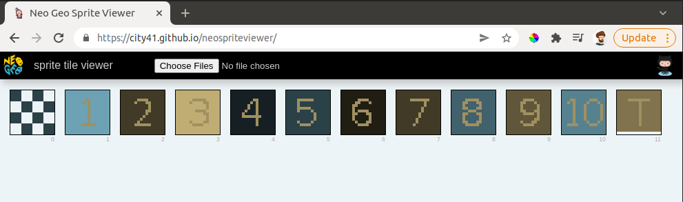
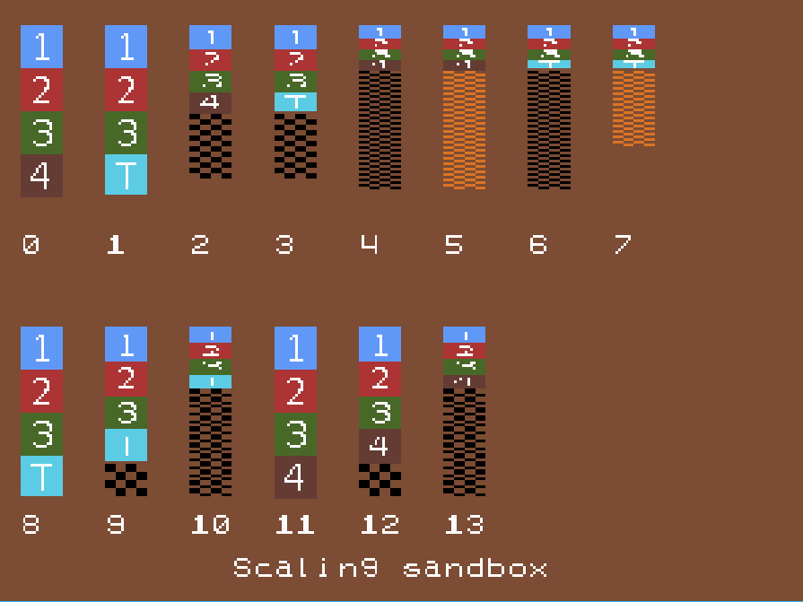
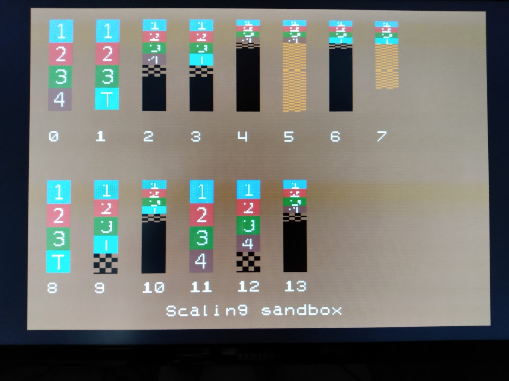
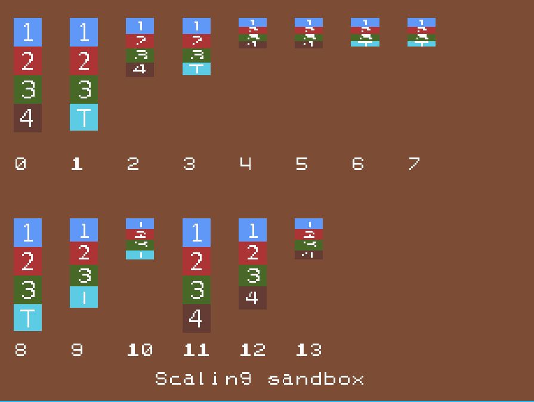
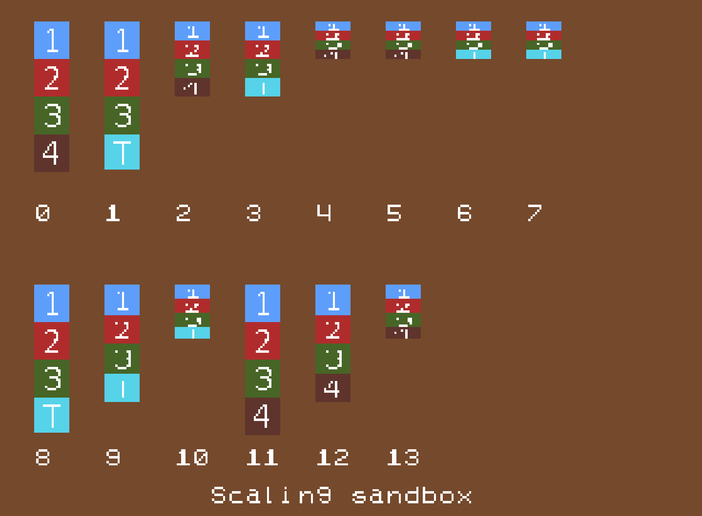
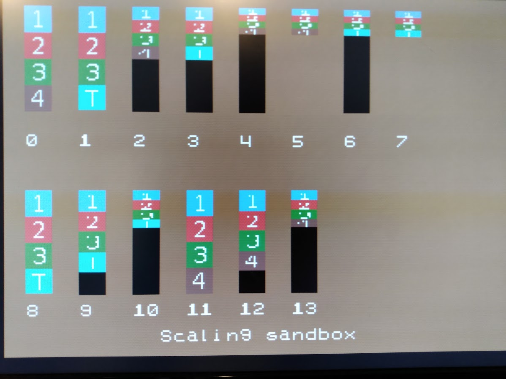

# Neo Geo Scaling sandbox

A small experiment exploring what graphical artifacts occur when scaling a sprite vertically.

## Have any input?

Please add it in [discussions](https://github.com/city41/neo-geo-scaling/discussions)

## The Setup

Here are the Character Tiles that were used. The last tile has its bottom row set to color zero. Magenta in this image gets translated to index zero (ie, transparent)

And how they are stored in the C ROM

## Results

Running on the version of GnGeo included with [ngdevkit](https://github.com/dciabrin/ngdevkit)

Running on real hardware: AES with Neo SD Pro

### sample 0

- character tiles 1 through 4
- height set to 4
- scaling set to full size (0xFFF)
- character tiles 4 through 32 in the vram tilemap (scb1) untouched

### sample 1

- character tiles 1 through 3 then the "transparent bottom line" tile
- height set to 4
- scaling set to full size (0xFFF)
- character tiles 4 through 32 in the vram tilemap (scb1) untouched

### sample 2

- character tiles 1 through 4
- height set to 4
- scaling set to half (0xF80)
- character tiles 4 through 32 in the vram tilemap (scb1) untouched

### sample 3

- character tiles 1 through 3 then the "transparent bottom line" tile
- height set to 4
- scaling set to half (0xF80)
- character tiles 4 through 32 in the vram tilemap (scb1) untouched

### sample 4

- character tiles 1 through 4
- height set to 4
- scaling set to one quarter (0xF40)
- character tiles 4 through 32 in the vram tilemap (scb1) untouched

### sample 5

- character tiles 1 through 4
- height set to 4
- scaling set to one quarter (0xF40)
- character tiles 4 through 32 in the vram tilemap (scb1) set to tile index 0, palette 0

### sample 6

- character tiles 1 through 3 then the "transparent bottom line" tile
- height set to 4
- scaling set to one quarter (0xF40)
- character tiles 4 through 32 in the vram tilemap (scb1) untouched

### sample 7

- character tiles 1 through 3 then the "transparent bottom line" tile
- height set to 4
- scaling set to one quarter (0xF40)
- character tiles 4 through 32 in the vram tilemap (scb1) set to tile index 0, palette 0

### sample 8-10

- character tiles 1 through 3 then the "transparent bottom line" tile
- height set to 4
- scalings set to full, 0xFC8 (78%), 0xF5A (35%)
- character tiles 4 through 32 in the vram tilemap (scb1) untouched

### sample 11-14

- character tiles 1 through 4
- height set to 4
- scalings set to full, 0xFC8 (78%), 0xF5A (35%)
- character tiles 4 through 32 in the vram tilemap (scb1) untouched

## Results when character tile zero is fully blank

These tests are identical to the above, except the tile at index 0 in the C ROM is now fully transparent instead of having a checkerboard pattern.

Running on the version of GnGeo included with [ngdevkit](https://github.com/dciabrin/ngdevkit)

Running on Mame 0.231 (April 2021 release)

Running on real hardware: AES with Neo SD Pro

# Findings

* GnGeo behaves differently from real hardware. Possibly enough to warrant attempting to patch GnGeo, as getting scaling correct currently requires running on real hardware often to ensure no unexpected graphical artifacts are left behind

* Best I can tell, setting the bottom row of a tile to be blank doesn't have any impact on graphical artifacts. This might be contrary to what is mentioned on [neogeodev's sprite shrinking page](https://wiki.neogeodev.org/index.php?title=Sprite_shrinking). However, it's possible the LSPC is looking at the last line of the tile specified in the 31st index? The second test where tile zero is blank does support that.

* The only way I could fully get rid of all graphical artifacts is to fill the remainder of the sprite's tiles with a blank tile. In this case, I chose tile zero.

# More TODO

* try this on MAME
* try this on other revisions of real hardware, do different versions of the LSPC do different things?
* does writing zeroes to the entire tilemap in VRAM before doing anything with sprites also get rid of the artifacting (assuming the tile at index zero is blank)?
* does the sticky bit haved any unexpected impact?
* does horizontal scaling have any unexpected impact?