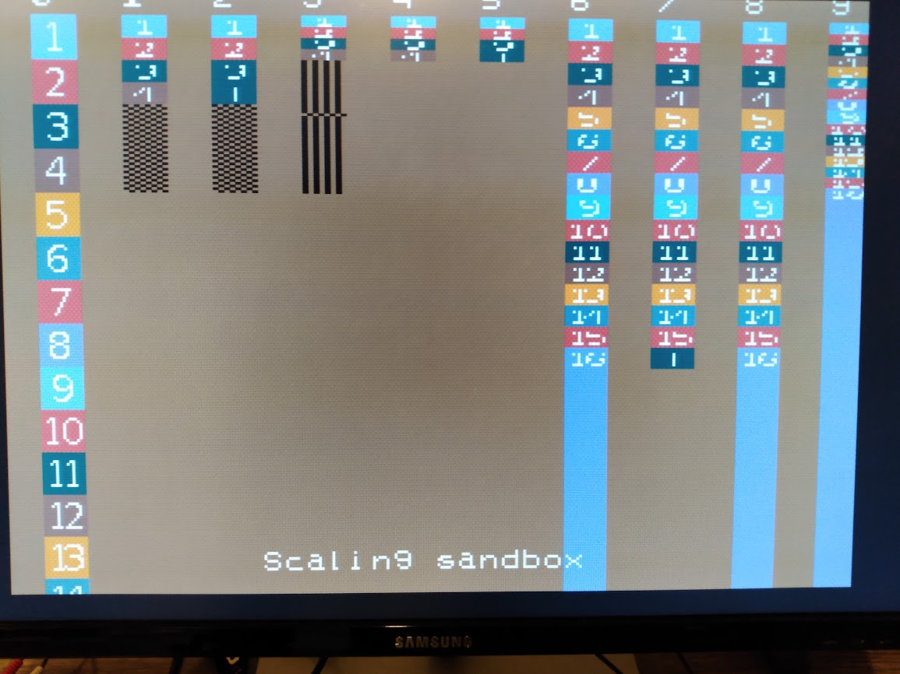

# Neo Geo Scaling sandbox

A small experiment exploring what graphical artifacts occur when scaling a sprite vertically.

## Have any input?

Please add it in [discussions](https://github.com/city41/neo-geo-scaling/discussions)

## The Setup

A bunch of filler tiles were added to the front of the C ROM (magenta means color index 0, ie transparent)

And here are the Character Tiles that were used. The last tile has its bottom row set to color zero. 

And how they all got stored in the C ROM

Notice that tile at index 255 is a checkerboard pattern, that plays a role in the findings. You can also see that checkerboard in the filler.png above

## Results

MAME 0.220

Running on real hardware: AES with Neo SD Pro, AES has LSPC-A0

### sample 0

- character tiles 1 through 17
- height set to 17
- scaling set to full size (0xFFF)
- character tiles 18 through 32 in the vram tilemap (scb1) untouched

### sample 1

- character tiles 1 through 4
- height set to 4
- scaling set to full half (0xF80)
- character tiles 5 through 32 in the vram tilemap (scb1) untouched

### sample 2

- character tiles 1 through 3 then the "transparent bottom line" tile at 4
- height set to 4
- scaling set to half (0xF80)
- character tiles 5 through 32 in the vram tilemap (scb1) untouched

### sample 3

- character tiles 1 through 4
- height set to 4
- scaling set to one quarter (0xF40)
- character tiles 5 through 32 in the vram tilemap (scb1) untouched

### sample 4

- character tiles 1 through 4
- height set to 4
- scaling set to one quarter (0xF40)
- character tiles 5 through 32 set to the transparent tile

### sample 5

- character tiles 1 through 3 then the "transparent bottom line" tile at 4
- height set to 4
- scaling set to one quarter (0xF40)
- character tiles 5 through 32 set to the transparent tile

### sample 6

- character tiles 1 through 16
- height set to 16
- scaling set to one half (0xF80)
- character tiles 17 through 32 in the vram tilemap (scb1) untouched

### sample 7

- character tiles 1 through 15 then the "transparent bottom line" tile at 16
- height set to 16
- scaling set to half (0xF80)
- character tiles 17 through 32 set to the transparent tile

### sample 8

- character tiles 1 through 16 then the "transparent bottom line" tile at 17
- height set to 17
- scaling set to half (0xF80)
- character tiles 18 through 32 in the vram tilemap (scb1) untouched

### sample 9

- character tiles 1 through 17 plus the "transparent bottom line" tile at 18
- height set to 18
- scalings set to one quarter (0xF40)
- character tiles 19 through 32 in the vram tilemap (scb1) untouched

# Findings

## Tile 0xff fills in left over space for sprites shorter than 16

When a sprite vertically scales down to be smaller than its height window, the remainder of that height window is filled with whatever tile is at position 255 (0xff) in the C ROM.

In this case, the tile at 0xFF is the checkerboard pattern. Looking at various C ROMs of commercial Neo Geo games, the tile at 0xFF is very often blank. For example, here is League Bowling

And here is Fatal Fury 3

## Sprites of height 16 use the last row of the last tile to fill in remaining space

If a sprite is exactly 16 tiles high, then the last row of the last tile appears to be used to fill in the remaining space of the window. As far as I can tell, this only works when the sprite's height is set to 16.

## Sprites of height greater than 16 do not scale properly

My experiments here -- as well as the game I am writing -- always have scaling issues if a sprite is taller than 16 tiles. It seems once tile 16 is hit, that tile is "smeared" down the screen.
